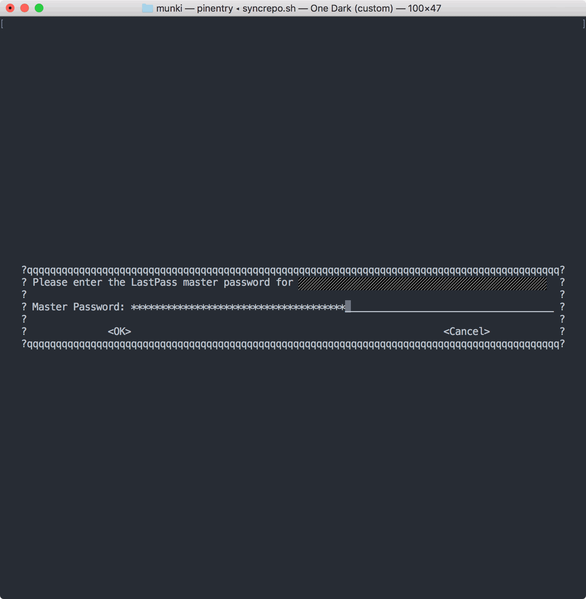

One of the sometimes overlooked but incredibly valuable features of Amazon Web Services are roles. Roles allow you to grant access to other AWS resources without the need for providing credentials. That's great for your servers but what about your personal machine? This post demonstrates a way to securely retrieve IAM credentials from LastPass and providing them to the AWS CLI. We are going to need the following tools: AWS CLI, LastPass CLI (lpass), jq.

## AWS CLI stores your credentials in plain text

As it turns out AWS CLI by default simply stores your credentials in _plain text_ inside `~/.aws/config`. So anybody with access to your computer can easily steal your IAM credentials. Neither your local user password nor elevated privileges are needed. That's bad.

## How to protect your credentials by using LastPass CLI

Turns out there is an easy way to protect your credentials from theft using LastPass. I have been using it to manage credentials for some time. But I only recently started using the [LastPass command line interface tool](https://github.com/lastpass/lastpass-cli). You can install it with [Homebrew](https://brew.sh/) by running `brew install lastpass-cli --with-pinentry`. With it we can retrieve any username and password from the command line by using the `lpass` command.

For example: Let's say we want to retrieve a username and password from a LastPass entry named _AWS IAM credentials_. We would do so by running:

```bash
lpass show --username "AWS IAM credentials"
lpass show --password "AWS IAM credentials"
```

### Nice, but how do we connect LastPass CLI with AWS CLI?

While browsing the [AWS CLI Command Reference](https://docs.aws.amazon.com/cli/latest/topic/config-vars.html) I came across a section about "[Sourcing Credentials From External Processes](https://docs.aws.amazon.com/cli/latest/topic/config-vars.html#sourcing-credentials-from-external-processes)" which explains how the AWS CLI can read JSON data from stdout. All we need to do is replace our set of IAM Access Key and Secret Access Key with a path to an executable which will be called by AWS CLI to get our credentials. Great!

Our `~/.aws.config` file before…

```properties
[default]
aws_access_key_id = foo
aws_secret_access_key = bar
region = us-west-2
```

and after:

```properties
[default]
credential_process = /path/to/script
region = us-west-2
```

Now all we need to do is write a script that calls _lpass_ and retrieves our IAM credentials from our LastPass entry.

### But wait! We do need to provide our response as JSON

Jq to the rescue. In case you haven't used it before, [jq is a command line tool for parsing and creating JSON](https://stedolan.github.io/jq/). I have first learned about it earlier this year during one of [Victor Vrantchan's talks at MacDevOpsYVR](https://www.youtube.com/watch?v=RAmc2RC4llI&feature=youtu.be&t=1381). You can install it by running `brew install jq`. We are using it to create a JSON object from the _lpass_ response.

```bash
#!/bin/bash

readonly lastPassEntry="AWS IAM credentials"
readonly accessKeyId=$(lpass show --username "$lastPassEntry")
readonly secretAccessKey=$(lpass show --password "$lastPassEntry")

# Create JSON object that AWS CLI expects
jq -n \
    --arg accessKeyId "$accessKeyId" \
    --arg secretAccessKey "$secretAccessKey" \
    '.Version = 1
    | .AccessKeyId = $accessKeyId
    | .SecretAccessKey = $secretAccessKey'
```

Our created JSON object will look something like the following:

```json
{
  "Version": 1,
  "AccessKeyId": "AKIAIABCDEFGHJKLMN",
  "SecretAccessKey": "axE+QqUQojdYalRU5C1UwebGv"
}
```

We are saving our script as _awscreds-lpass.sh_, store it inside the `~/.aws` folder and set permissions to make it executable.

```bash
chmod 750 ~/.aws/awscreds-lpass.sh
```

Then we are replacing our `~/.aws/config` file with the following:

```properties
[default]
credential_process = /Users/<your-user-name>/.aws/awscreds-lpass.sh
region = us-west-2
```

Make sure to replace `<your-user-name>` with your macOS user name, which can be retrieved by running `id -un`.

## Customizing master password prompt timeout

By default the LastPass CLI agent will store your credentials for one hour. After that you will be prompted to provide your master password the next time you are running _lpass_. If you are using the AWS CLI a lot this would mean retyping your LastPass master password every hour. Fortunately [there is a way to customize the timeout window](https://lastpass.github.io/lastpass-cli/lpass.1.html) by defining an environment variable `LPASS_AGENT_TIMEOUT` and specifying the timeout length in seconds.

I have added this to my `~/.bash_profile`:

```bash
export LPASS_AGENT_TIMEOUT=28800
```

## Wrapping up

One caveat to this approach: If you are running AWS CLI outside of a Terminal, e.g. in a task runner within your editor, you might get an error if the timeout window has passed. In this case it should be sufficient to run any AWS CLI command in an interactive Shell, enter your password and than use your task runner as long as the current timeout window has not been closed.

I have [published a slightly tweaked script](https://gist.github.com/paulgalow/109bdc118ec6d884b0f7d5d152920fd5) including some error handling. Based on this approach it should be easy to adapt this process to a different password manager such as the built-in macOS keychain (using the `security` command).
