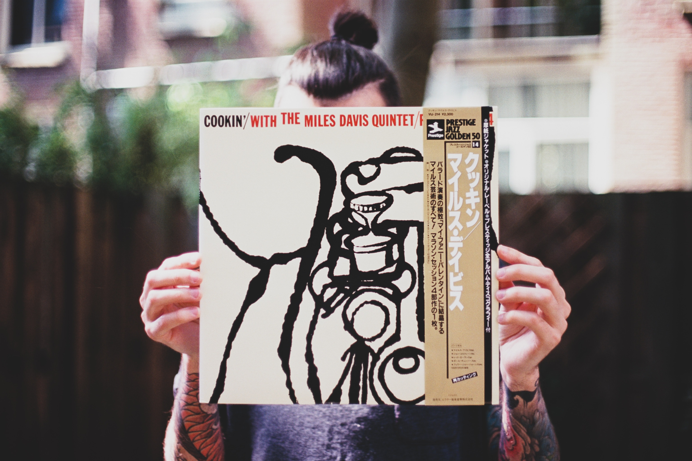

I remember the old days before music streaming became ubiquitous. Back then, I used to put a lot of time and care into my music collection. I would put each of my CDs into my CD-ROM drive's tray and, one after the other, create a collection of MP3 (later AAC) files. Then I would tag this group of files with a diverse set of metadata such as the year it was published or its musical genre. That way I could easily generate different lists of music. One of iTunes' rarely used features that would use this information is [Smart Playlists](https://support.apple.com/guide/itunes/use-smart-playlists-itns3001/mac). They would allow me to automatically create collections such as "2012 Hits" or "Top Albums" so that I could easily listen to my favorites.

Finding a high-resolution image of an album's cover art could sometimes take a substantial amount of time, especially if that piece of music sat at the fringes of musical genres.

## 🔍 Peeking at Apple's iTunes Search API

Fast forward 10 years. Recently I was playing around with Apple's [iTunes Search API](https://developer.apple.com/library/archive/documentation/AudioVideo/Conceptual/iTuneSearchAPI/index.html). By default, Apple's JSON response object contains two album art related keys, ```artworkUrl60``` and ```artworkUrl100```. For example:

```json
{
  "wrapperType": "collection",
  "collectionType": "Album",
  "artistId": 29836830,
  […]
  "artworkUrl60": "https://is5-ssl.mzstatic.com/image/thumb/Music/v4/e1/2c/5c/e12c5c93-b5d2-f4a0-50e7-f076ba1233f5/source/60x60bb.jpg",
  "artworkUrl100": "https://is5-ssl.mzstatic.com/image/thumb/Music/v4/e1/2c/5c/e12c5c93-b5d2-f4a0-50e7-f076ba1233f5/source/100x100bb.jpg",
  […]
}
```

Turns out we can download high-quality album art by simply modifying the height and width values in those image URLs, e.g. replacing ```100x100bb.jpg``` with ```5000x5000bb.jpg```. Apple's API is actually smart enough to automatically return the highest resolution image even if our specified resolution of 5000 x 5000 px does not exist. In fact, the highest resolution file I have downloaded was 3000 x 3000 px.

## 🖼️ Introducing albumart-dl

So I set myself the challenge to improve my Python skills and get some experience with packaging and distributing a Python application. The result is [albumart-dl](https://github.com/paulgalow/albumart-dl) a free and open-source command-line tool that lets you download album art from Apple's servers. Its name and function is inspired by [youtube-dl](http://rg3.github.io/youtube-dl/) and [you-get](https://you-get.org/), two tools I like and use regularly 🤟.

If you are on macOS you can install it via [Homebrew](https://brew.sh/). Perhaps it is useful to some of the lone wolves out there who still prefer to curate their digital music collection by hand. You can [find out more about it on GitHub](https://github.com/paulgalow/albumart-dl).