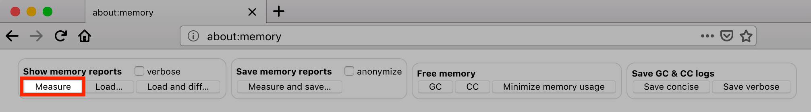

In this post we are leveraging the `Extensions` and `InstallAddonsPermission` configuration profile keys to manage Firefox extensions. As an example we are going to deploy the fantastic [uBlock Origin](https://addons.mozilla.org/firefox/addon/ublock-origin/) extension using a profile. Once that's in place Firefox will automatically install the extension.

Up until recently a [common way to manage Firefox settings/policies](https://www.amsys.co.uk/using-firefox-cck2-and-autopkg/) was to create a custom `autoconfig.zip` file as part of your Firefox deployment using the [CCK2 tool](https://mike.kaply.com/cck2/) and building a custom deployment package. Thankfully AutoPkg and some [fellow Mac admins](https://github.com/autopkg/gregneagle-recipes/tree/master/Mozilla) have made this potentially labor-intensive process much easier (and automated).

## Firefox now supports configuration profiles

Thanks to [Mike Kaply](https://twitter.com/MikeKaply) (who also happens to be the creator of CCK2) and the Firefox team you can now use configuration profiles to manage Firefox' settings starting with [v64.0](https://www.mozilla.org/en-US/firefox/64.0/releasenotes/). Mozilla kindly published a [list of all payload keys](https://github.com/mozilla/policy-templates) as well as an [example *plist* file](https://github.com/mozilla/policy-templates/tree/master/mac) to get you started.

## Gathering required information

To manage an extension we are going to need two pieces of information:

- its XPI download URL
- its extension ID (an e-mail address)

### How to find the download URL

To get its XPI download URL we are heading to the [Firefox Add-ons portal](https://addons.mozilla.org/firefox/) and search for uBlock Origin. Next, click on the search result to get to the [dedicated page](https://addons.mozilla.org/de/firefox/addon/ublock-origin/) for that extension. Once there, in the left sidebar click on the small link "[See all versions](https://addons.mozilla.org/firefox/addon/ublock-origin/versions/)" below "Version History".


Finally, right click on the "Add to Firefox" button, copy the underlying download URL and paste it into your editor. We are going to need this to create our profile.


### How to find the extension ID

First, we need to manually install our desired extension in Firefox. Next, type in `about:memory` in the Firefox URL field and press *return*.

Under *Show memory reports* click on *Measure*.



A few seconds later you should see tree-like structure with a bunch of processes and memory allocation values. Scroll down to *Other Measurements* and look for a subsection named *extensions*.

```ini
7 (100.0%) -- extensions
…
├──1 (14.29%) ── Extension(id=uBlock0@raymondhill.net, name="uBlock Origin", baseURL=moz-extension://c0cf5873-7141-1a46-93dc-d9d16b0f2189/)
```

Hopefully, you should then be able to identify the extension needed. uBlock Origin's extension ID is `uBlock0@raymondhill.net`. Note that down as well. We are going to use it to lock down our extension, i.e. disabling the GUI option to uninstall the extension.

## How to install an extension's latest version

Firefox' `Extensions` profile key expects a URL pointing to an XPI file. This is great if you want to install a specific version of an extension. However, in my case, I want to make sure the latest version gets installed and I don't want to update that version number manually. So what to do about that?

> 302 redirects to the rescue.

Turns out the Firefox API intelligently reroutes requests to the latest version of the extension if we don't specify a particular version:

```bash
curl -I https://addons.mozilla.org/firefox/downloads/file/1166954/ublock_origin.xpi
```

```http
HTTP/1.1 302 Found
…
Location: https://addons.cdn.mozilla.net/user-media/addons/607454/ublock_origin-1.17.4-an+fx.xpi?filehash=sha256%3A54c9a1380900eb1eba85df3a82393cef321e9c845fda227690d9377ef30e913e
…
```

Perfect. Now, all we need to do is to remove the version information from our XPI download URL. For example:

From:

```url
https://addons.mozilla.org/firefox/downloads/file/1166954/ublock_origin-1.17.4-an+fx.xpi?src=version-history
```

To:

```url
https://addons.mozilla.org/firefox/downloads/file/1166954/ublock_origin.xpi
```

## Creating our configuration profile

Bringing it all together. We are using the following snippet as a template:

```xml
<key>Extensions</key>
<dict>
    <key>Install</key>
    <array>
        <string>XPI-DOWNLOAD-URL-HERE</string>
    </array>
    <key>Locked</key>
    <array>
        <string>EXTENSION-ID-HERE</string>
    </array>
</dict>
```

Also, we may want to restrict permitted sources where to install Firefox extensions from. In this example, I am permitting extensions to be installed from the official Firefox Add-ons portal only.

```xml
<key>InstallAddonsPermission</key>
<dict>
    <key>Allow</key>
    <array>
        <string>https://addons.mozilla.org/</string>
    </array>
    <key>Default</key>
    <true/>
</dict>
```

To activate our profile payload we have to add a Firefox specific profile key and set its value to *true*.

```xml
<key>EnterprisePoliciesEnabled</key>
<true/>
```

## Examples and more settings to manage

I have posted a [sample configuration file](https://gist.github.com/paulgalow/9ffc4840586a3a9b47ec4c068de96928) for reference if you would like to see the final result. I have successfully tested this on macOS 10.13.6 and macOS 10.14.2. If you would like to create your profile via the GUI, have a look at Erik Berglund's [ProfileCreator](https://github.com/erikberglund/ProfileCreator).

There are many more Firefox settings that can now be easily managed via profiles, and I would like to encourage you to [have a look at them](https://github.com/mozilla/policy-templates).