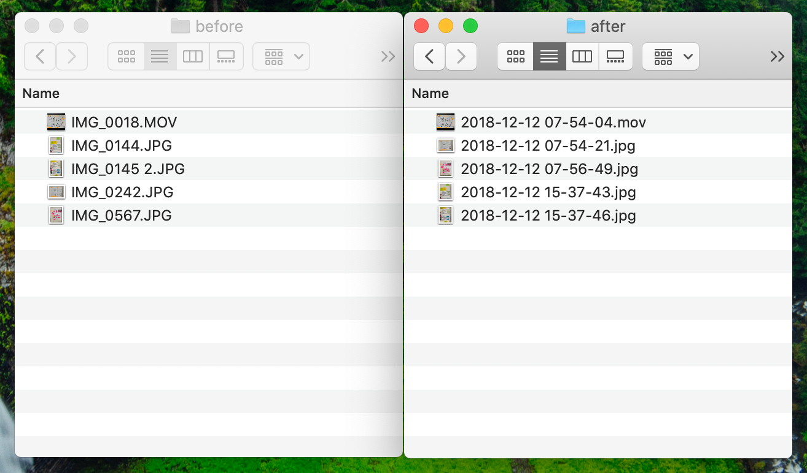
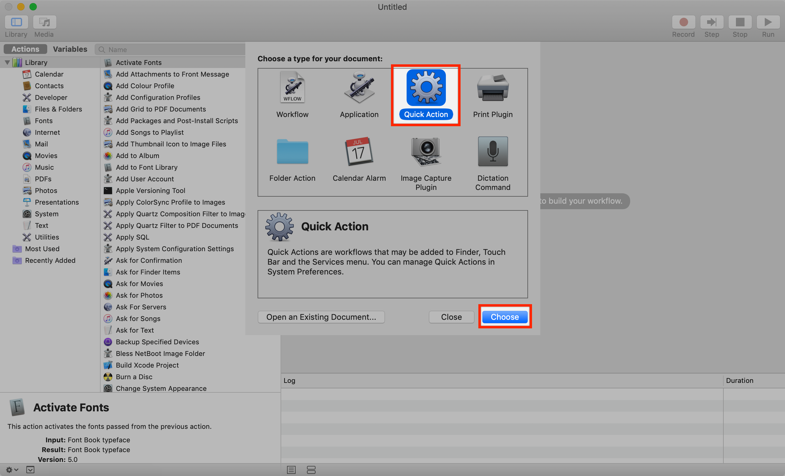
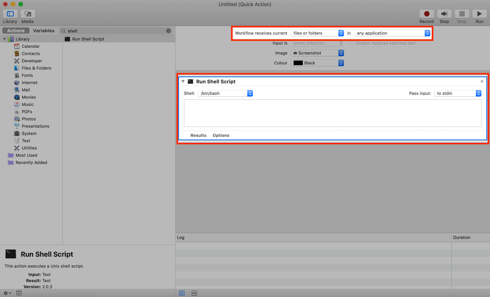

Have you ever transferred a bunch of photos/videos from an iOS device using AirDrop?
If so you will have noticed the odd file names of those items on your Mac, such as _IMG_0144.JPG_.

What's worse: The numbers attached to each file don't correspond to the sequence of events during which they were taken. You might think you could browse those files chronologically in your browser simply by sorting them by name. But at least in my testing, that is not necessarily the case.

## Naming image and video files based on the time they were taken

What if you wanted to browse your photos and videos in the Finder in chronological order? Turns out all of those media files have an EXIF timestamp set as metadata. Tools like Adobe Lightroom have used that for a long time to categorize and name your files.

But what if I you don't want to use a specialized media management tool? Turns out we can leverage [macOS Mojave's Quick Actions](https://www.macrumors.com/how-to/use-quick-actions-in-macos-mojave/) to get the job done directly from Finder. The following Quick Action is inspired by [Armin Briegel's excellent blog post](https://scriptingosx.com/2018/11/mojave-quick-action-to-package-apps/).

At the core of our solution is Apple's built-in _mdls_ tool. With that, we can retrieve the metadata we are interested in, in this case, `kMDItemContentCreationDate`.

```bash
getTimeStamp() {
    local -r timestampRaw=$(mdls "$file" | awk '/^kMDItemContentCreationDate / { print $3 " " $4 }')
    timestamp=${timestampRaw//:/-}
}
```

Using this tool in a Quick Action we can turn our file names from:

```shellscript
.
├── IMG_0018.MOV
├── IMG_0144.JPG
├── IMG_0145 2.JPG
├── IMG_0242.JPG
├── IMG_0567.JPG
```

into

```shellscript
.
├── 2018-12-12 07-54-04.mov
├── 2018-12-12 07-54-21.jpg
├── 2018-12-12 07-56-49.jpg
├── 2018-12-12 15-37-43.jpg
└── 2018-12-12 15-37-46.jpg
```

Please note the resulting timestamps are UTC based.

## Creating a Quick Action in Automator

To get started, open up Apple's _Automator_ and create a new Quick Action.



Make sure our Quick Action receives _files or folders_ in _any application_. We can customize the image which will be displayed in Finder later on. Next, drag a new _Run Shell Script_ action from the sidebar to the empty area below.



## Handling images and videos

Since we want to handle images or videos we cannot use Automator's built-in input selection. That only allows us to choose between image or movie files. To work around this issue we are going to handle input validation directly inside our Shell script. Using the _file_ command we are extracting a file's MIME type. The supported MIME types for this Quick Action are _image/jpeg_ and _video/quicktime_. Using that information we can guard our script against processing unwanted files that might reside inside the same folder as our photo or video files.

```bash
hasMIMEType() {
    file -I "$file" | grep -q "$1"
}

setFileExtension() {
    if hasMIMEType "image/jpeg"
    then
        extension="jpg"
    elif hasMIMEType "video/quicktime"
    then
        extension="mov"
    else
        return 1
    fi
}
```

## Non-destructive behavior

To minimize the risk of potential data loss our Quick Action is trying hard to act non-destructively. It creates a subfolder named _sorted_ inside the folder where it is applied and copies the renamed media files to this new location. The result is a second, separate copy of our files.

```bash
createDestination() {
    readonly destination="$(dirname "$file")/sorted"
    mkdir -p "$destination"
}
```

One thing we have to keep in mind: EXIF timestamps only provide timestamp granularity to the second. This can become a problem if we are taking multiple images per second, e.g. when using [burst mode](https://support.apple.com/en-jo/HT205659). When that happens our script generates an MD5 hash of the file and appends it to the end of its name. Please note: MD5 is generally considered unsafe and should not be used for any security-related purposes. Our case is an exception because all we want is a unique file name from a limited set of source files. Feel free to change this to SHA-256 if you still feel uncomfortable.

```bash
renameFile() {
    # Exit function if file type is not supported
    setFileExtension || return 0

    getTimeStamp || return 0

    createDestination || return 1

    # Check if to be renamed file already exists
    if [[ -f "$destination/$timestamp.$extension" ]]
    then
        # If file exists append random string to file
        local -r randomString=$(md5 -q "$file")
        cp "$file" "$destination/$timestamp-$randomString.$extension"
    else
        cp "$file" "$destination/$timestamp.$extension"
    fi
}
```

## Basic Notification Center support

Processing a large number of files can take a while so our Quick Action emits a simple notification at the beginning and once it has finished processing all files.

```bash
sendNotification() {
    osascript <<-EndOfMessage
    display notification \
    "$1" \
    with title "Rename (Timestamp)"
EndOfMessage
}

sendNotification "Processing photos/videos.\\nThis can take a while…"
```

## Finishing up and handling installation

To finish up, [copy the script's code](https://gist.github.com/paulgalow/70bff79dcf1f4a0ec74ccff6e50e1bc9) into Automator's _Run Shell Script_ section. Finally, you can export our Quick Action and save it as a workflow file.

Installing is as easy as double-clicking the resulting \*.workflow bundle. If you want to deploy this to other Macs, place the bundle inside `~/Library/Services/`. You could create a package to do that. Once that's been done you can directly access your Quick Action from Finder.
