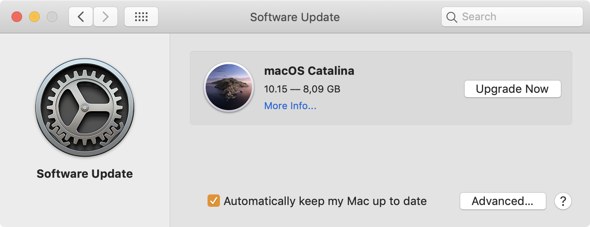
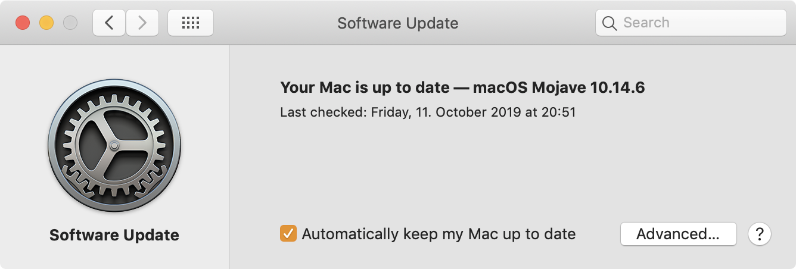

#### tl;dr

I have published a simple [Puppet module](https://github.com/pbihq/puppet-module-ignore_update)
to manage softwareupdate's list of ignored updates.
This can be used to hide the banner prompting you to upgrade to macOS Catalina.

---

Every year, sometime in autumn a sudden rush of adrenaline goes through
my veins. As Apple is nudging its macOS users to upgrade to its newly
released OS my level of anxiety rises.

_Shouldn't you be ready to support the latest OS on day one?_ Of course.
You're right. I should. But unless you are running Apple's homegrown selection of apps
exclusively, chances are not every software vendor is ready to support the latest
and greatest macOS on day one.

macOS Catalina has been no exception. Apple is swiftly (no pun intended)
rebuilding large parts of the core OS in what seems to be a multi-year plan to
make macOS as secure as iOS. So you can imagine my excitement when earlier this
week Apple started nudging my colleagues to upgrade to Catalina.

Only this time, that prompt didn't pop up as a persistent notification (yet).
Instead, Apple decided to put it directly into the Software Update pane.



Granted, I wasn't really that surprised since Apple had moved system updates
from the Mac App Store back to System Settings with the release of macOS Mojave.
But moving it there means it can potentially be managed using the built-in
"softwareupdate" tool.

Soon after, thanks to [Robert Hamman](https://twitter.com/hammen/status/1181295216600338432)
and [Rich Trouton](https://derflounder.wordpress.com/2019/10/07/preventing-the-macos-catalina-upgrade-advertisement-from-appearing-in-the-software-update-preference-pane-on-macos-mojave/)
I learned that indeed, this is possible:

```shell
softwareupdate --ignore "macOS Catalina"
```

Once you run that, the upgrade banner immediately disappears (which can't be
said about the glowing red notification numeral attached to the Software Update
and System Settings icons).



What's more: Running the above command even prevents users from manually
installing Catalina via the App Store.

Once you're ready to go ahead with the latest and greatest macOS, run the
following to bring back the upgrade banner (and reset any other ignored updates):

```shell
softwareupdate --reset-ignored
```

Great. But how to manage that among a fleet of machines? You could use
[Outset](https://github.com/chilcote/outset) to add that to your startup scripts,
but that would only run when a user restarts its machine. And don't we all love
doing that?

Another option would be to run a payload free package using
[Munki](https://github.com/munki/munki) but that still wouldn't keep track of
softwareupdate's internal state.

Ultimately, a configuration profile would be neat to handle ignored updates
directly. In the meantime, I have put together a simple [Puppet module](https://github.com/pbihq/puppet-module-ignore_update) to idempotently manage softwareupdate's list of ignored updates.
You can use it to ignore multiple updates at once or to make sure that no updates
are ignored whatsoever.

Check out the [GitHub repository](https://github.com/pbihq/puppet-module-ignore_update)
for more information. I hope this comes in handy for you as well.
