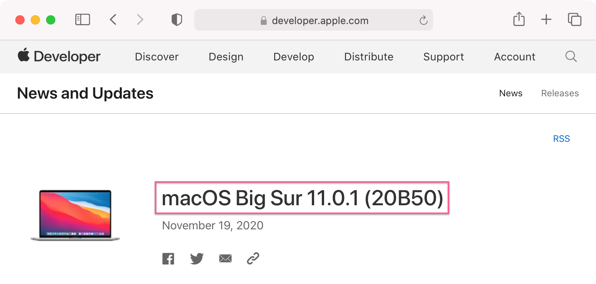
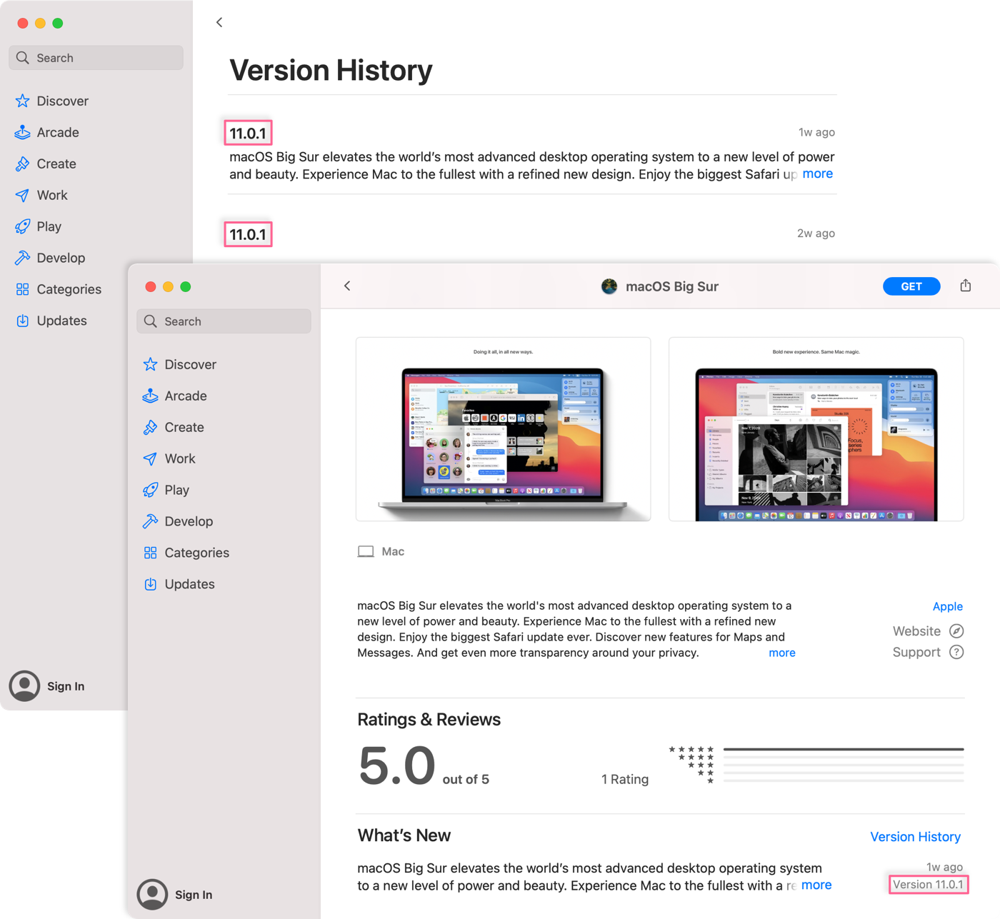
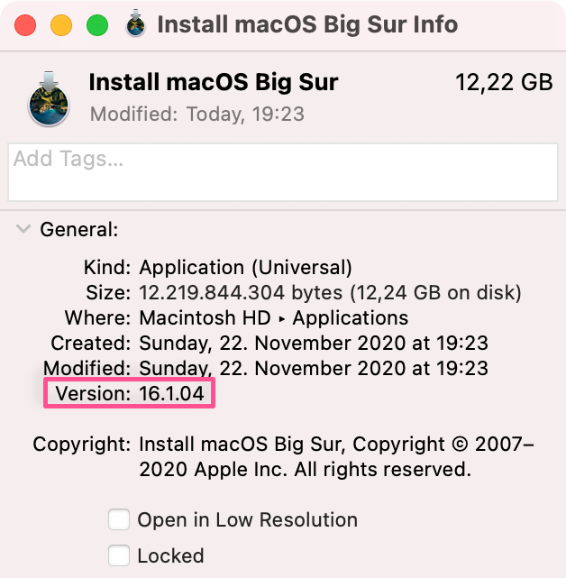

## A new macOS release ≠ a new version

A few days ago, Apple released an updated build of macOS 11.0.1 to [address a bug](https://support.apple.com/en-us/HT211242) that prevented some older MacBook Pro computers from upgrading to Big Sur. Rather than incrementing the release version to 11.0.2 or similar, Apple instead once more only released a new build version: "20B50" in this case. This process has been long known in the Mac Admins community, with some fellow admins now recommending [using build version strings instead of release version numbers](https://scriptingosx.com/2020/09/macos-version-big-sur-update/) when determining the current OS. Fortunately, Apple publishes the latest build versions on its [developer portal](https://developer.apple.com/news/releases/).



When downloading a fresh installer for Big Sur from Apple, however, this useful piece of information is not communicated and immediately evident. Unfortunately, Apple's [Big Sur listing on the Mac App Store](https://apps.apple.com/de/app/macos-big-sur/id1526878132?mt=12) only lists the current release version with its build version nowhere to be found.



All right, let's download the installer and check the "Install macOS Big Sur" installer app itself for any build version clues.



Upon inspecting the app in Finder we are presented with another version number, "16.1.04" in this case. Drilling down further into `Contents/Info.plist` reveals another set of build numbers such as "BuildMachineOSBuild", "DTPlatformBuild" or "DTXcodeBuild". None of them contain our official build version string of "20B50".

## How to determine InstallAssistant's build number on Big Sur

In 2017 Tim Sutton published a very helpful [blog post on how to extract version and build string from a macOS installer](https://macops.ca/what-macos-version/). Up until Catalina I have been using his findings to determine the exact versions of Apple's installers. However, with the release of Big Sur things have changed.

Here are the steps to extract our desired information from a Big Sur InstallAssistant using the command line:

1. Mount `Contents/SharedSupport/SharedSupport.dmg`:

   ```sh
   hdiutil attach -noverify -quiet \
   "/Applications/Install macOS Big Sur.app/Contents/SharedSupport/SharedSupport.dmg"
   ```

2. Extract "OSVersion" and "Build" keys from `com_apple_MobileAsset_MacSoftwareUpdate.xml`:

   ```sh
   /usr/libexec/PlistBuddy \
   -c "Print :Assets:0:OSVersion" \
   -c "Print :Assets:0:Build" \
   "/Volumes/Shared Support/com_apple_MobileAsset_MacSoftwareUpdate/com_apple_MobileAsset_MacSoftwareUpdate.xml"
   ```

   Output:

   ```sh
   11.0.1
   20B50
   ```

3. Unmount `Shared Support` volume

   ```sh
   hdiutil detach -quiet "/Volumes/Shared Support/"
   ```

## How can I automate this

I have written a [simple shell script](https://gist.github.com/paulgalow/71d609da0322f09c67531d5f5773ffc1) to automate this process. Save it to disk and pass it a path to a macOS Big Sur InstallAssistant app, like so:

```sh
./get-macos-build.sh "/Applications/Install macOS Big Sur.app/"
```

## Looking ahead

Since Apple uses the macOS build version to identify and distinguish its installers, I would suggest publishing that information directly inside InstallAssistant's info.plist. Perhaps even make it visible in Finder? That would be neat and simplify my deployment workflow. Or perhaps there might be an easier method to extract that information? If there is, I would like to know.
