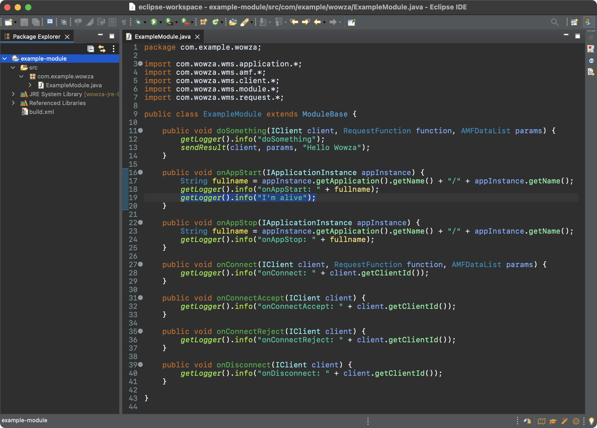
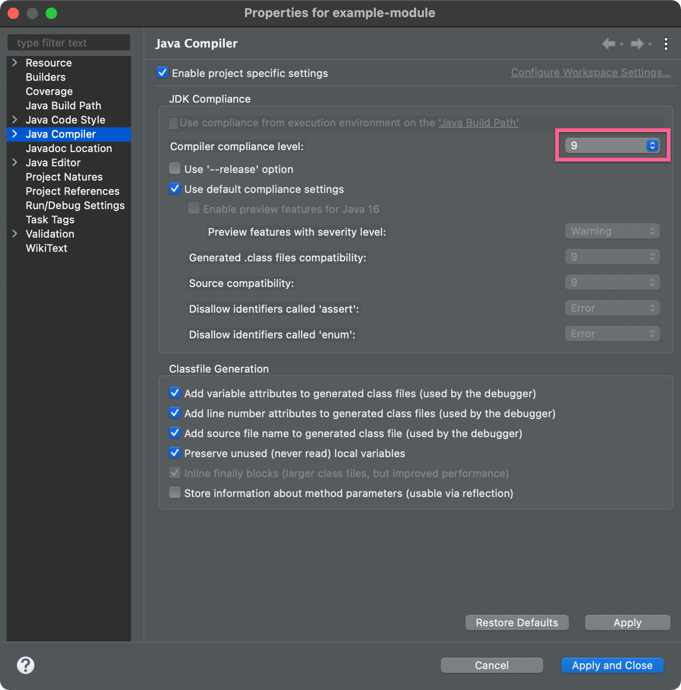
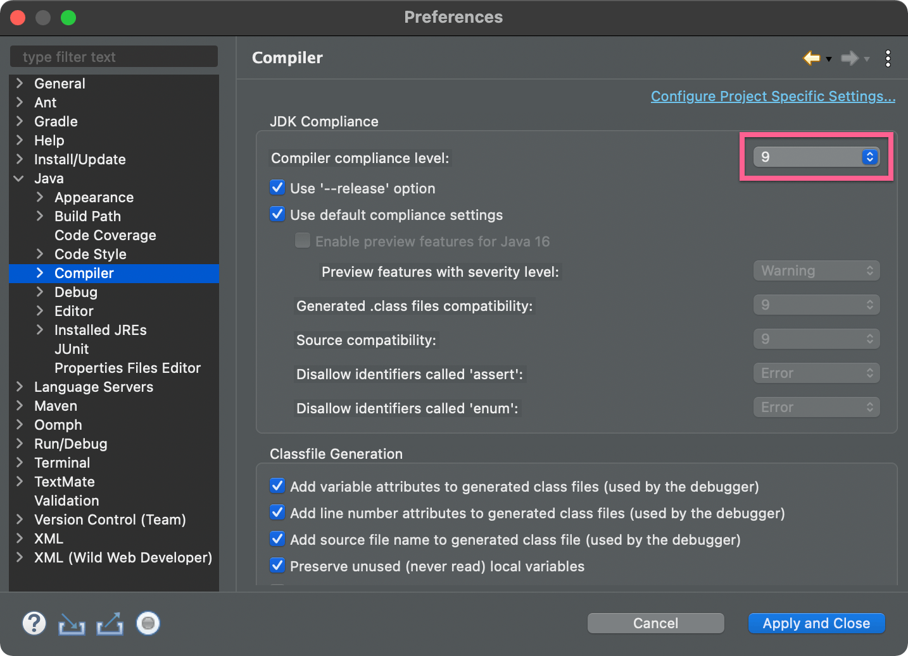
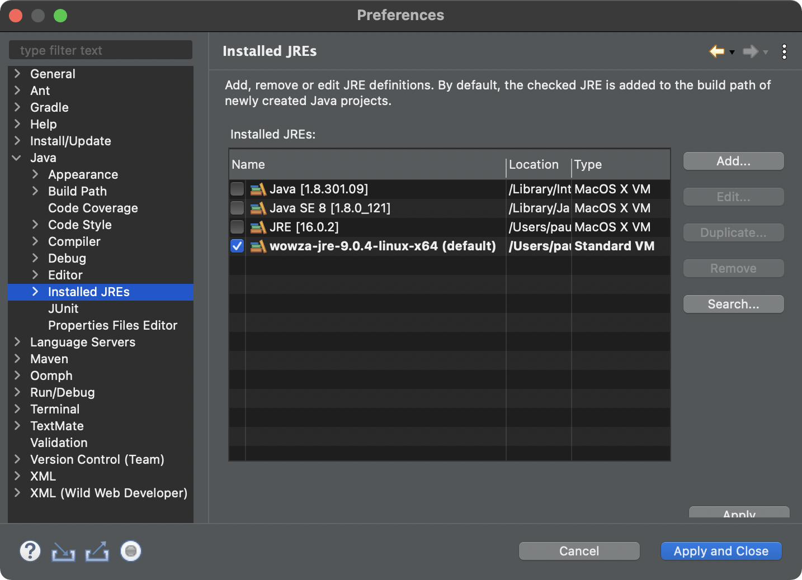

#### tl;dr

Follow Wowza's [official instructions to set up Eclipse](https://www.wowza.com/docs/How-to-extend-Wowza-Streaming-Engine-using-the-Wowza-IDE). Then, customize compiler settings by [installing and linking a compatible Java JRE version](https://www.wowza.com/community/t/module-class-not-found-or-could-not-be-loaded-check-install-dir-conf-test-application-xml-to-be-sure-all-modules-module-class-paths-are-correct/50912/3).

---

"Why is this not working?" shouted the angry developer at his innocent screen. Hello everyone and boy, have I been struggling with building a custom module for [Wowza Streaming Engine](https://www.wowza.com/docs/wowza-streaming-engine-java-api).

⚠️ Disclaimer: I am _not_ a Java developer so the language, the tooling, all of it was new to me. In this post, I intend to share my journey to hopefully make it easier for others. Also, I assume you are following this tutorial on a machine running a recent version of macOS. If not, you might need to adapt some of the commands provided.

In this post we are going to:

- Setup Wowza Streaming Engine (WSE) locally using Docker
- Install a custom Wowza JRE version
- Install Eclipse IDE
- Create a basic Wowza Streaming Engine Java module for a Linux runtime

## Setup Wowza Streaming engine locally using Docker

This step is optional. If you already have an instance of Wowza Streaming Engine running, you can use that one instead.

### Background

I prefer running Wowza Streaming Engine inside Docker, mainly because of maintenance reasons. I find installing a newer version much easier than [in-place updating an already installed version](https://www.wowza.com/docs/how-to-update-your-wowza-streaming-engine-installation). Also, using bind-mounts / Docker volumes you can more easily separate your custom config from the rest of the installation and track your changes in source control systems.

That said, [Wowza's official Docker image](https://hub.docker.com/r/wowzamedia/wowza-streaming-engine-linux) is updated rather infrequently. I contacted their customer support about this but did not receive a satisfactory reason why. 🤷‍♂️

For this setup, we are going to bind-mount the `lib` subdirectory from `/usr/local/WowzaStreamingEngine/` to our host filesystem. You probably would not want to do this in production since the content of that folder changes with updates to Wowza Streaming Engine. However, we are going to need those Java libraries to compile our module. Also, to preserve our Wowza application state, we are going to bind-mount three more subfolders: `applications`, `conf`, and `content`.

### Setting up Docker Compose

To make our lives easier we are going to use Docker Compose to run our Docker container locally. Let's get started:

First, create a local project folder and switch to it:

```sh
mkdir -p wowza-module-dev
cd wowza-module-dev
```

Inside the folder, create a file named `docker-compose.yml` and use the following configuration as a starter:

```yaml
services:
  application:
    container_name: wowza
    image: wowzamedia/wowza-streaming-engine-linux:latest
    entrypoint: /sbin/entrypoint.sh
    restart: unless-stopped
    ports:
      - "8000:80" # RTMP streaming fallback
      - "443:443" # RTMPS streaming
      - "1935:1935" # RTMP and HLS streaming
      - "8086-8088:8086-8088" # Administration
      - "8089:8089" # REST API documentation server
      - "8090:8090" # HTTPS for Wowza Streaming Engine Manager (web interface)
    volumes:
      - ./applications:/usr/local/WowzaStreamingEngine/applications
      - ./conf:/usr/local/WowzaStreamingEngine/conf
      - ./content:/usr/local/WowzaStreamingEngine/content
      - ./lib:/usr/local/WowzaStreamingEngine/lib:ro
    networks:
      - public

networks:
  public:
```

Wowza provides some [configuration options](https://www.wowza.com/docs/how-to-set-up-wowza-streaming-engine-using-docker) to refine our setup later.

Before starting our container setup, we need to copy the required files from inside the WSE container.

Create a temporary container, copy the required folder and files to our project folder, then delete the temporary container:

```sh
docker create -it --name wowza wowzamedia/wowza-streaming-engine-linux:latest bash
docker cp wowza:/usr/local/WowzaStreamingEngine/applications/ .
docker cp wowza:/usr/local/WowzaStreamingEngine/conf/ .
docker cp wowza:/usr/local/WowzaStreamingEngine/content/ .
docker cp wowza:/usr/local/WowzaStreamingEngine/lib/ .
docker rm -f wowza
```

## Download custom JRE version

At the time of this writing, Eclipse IDE comes with Java 16 installed. However, WSE v4.7.8 and later [_requires OpenJDK Java SE JRE 9.0.4 at a minimum but supports up to Java version 12_](https://www.wowza.com/docs/manually-install-and-troubleshoot-java-on-wowza-streaming-engine).

This means our custom WSE module will compile in Eclipse, but it will not run in WSE. Finding this out took me days. Therefore we have to change Eclipse's compiler settings and instead link to a version of the Java JRE which is supported by WSE.

Fortunately, Wowza offers a [custom packaged version of OpenJDK Java SE JRE 9.0.4](https://www.wowza.com/downloads/jre/jre-9.0.4.zip). This version will contain the appropriate files for Linux, macOS, and Windows.

For this tutorial, we are going to use the Linux version. Let's download and unzip the custom JRE and then place it in a directory inside our project folder:

```sh
mkdir -p ./wowza-jre-9/
curl https://www.wowza.com/downloads/jre/jre-9.0.4.zip \
  | tar -jx --strip-components=1 -C ./wowza-jre-9/
```

---

For the curious: If you'd like to know which version of Java your installation of WSE is currently running on, you can retrieve that information easily using Docker. Assuming you are using the latest version of WSE's Docker image (v4.8.12 at the time of this writing).

Using Docker, run the following in your Terminal:

```sh
docker run --rm -it wowzamedia/wowza-streaming-engine-linux:latest \
   /usr/local/WowzaStreamingEngine/java/bin/java -version
```

Example output:

```sh
openjdk version "9.0.4"
OpenJDK Runtime Environment (build 9.0.4+11)
OpenJDK 64-Bit Server VM (build 9.0.4+11, mixed mode)
```

You can also get to that information using the Wowza Streaming Engine Manager. You can [set username and password using environment variables](https://www.wowza.com/docs/how-to-set-up-wowza-streaming-engine-using-docker#additional-parameters4) in our Docker Compose file (`docker-compose.yml`). If not specified, username and password both default to "wowza".

## Set up Eclipse and Wowza IDE

Next, we are going to set up our custom Wowza module, but first, [follow Wowza's official guide](https://www.wowza.com/docs/how-to-extend-wowza-streaming-engine-using-the-wowza-ide) to A) install Eclipse IDE and B) install the Wowza IDE.

## Set up a custom Wowza module

Once finished with steps A) and B) we are finally going to set up our Wowza module. We are using Wowza's guide as a basis but will adjust it to fit with our local setup:

### Eclipse setup: Wowza module

1. In Eclipse, choose File > New > Other.
2. Select Wowza Streaming Engine Project and then click Next.
3. In the New Wowza Streaming Engine Java Project window, enter the following information:
   1. Project name – A name for the project and the .jar file output. The name can't contain spaces. Let's call our project "example-module"
   2. Location – The path to our Wowza Streaming Engine installation. Here we are going to specify the location of our project folder, i.e. `wowza-module-dev`
4. Click Next.
5. On the New Wowza Streaming Engine Module Class page, enter the following information:
   1. Package – The Java package path for your project. The Java convention is a reverse domain, for example, `com.mycompany.wowza`. The path can't begin or end in a period. Let's call our package `com.example.wowza`
   2. Name – A name for the module class. The Java convention uses camel case. Let's call this one "ExampleModule"
6. Click Finish. You should see a new package called "example-module" in the left navigation bar. If you expand the arrow buttons, you should find a file named `ExampleModule.java`

The next step is optional: Let's add a line to our custom module code to make it easier to see if our module is working. Inside the `onAppStart` method, let's add a line to the end. This will write `I'm alive` to the WSE logs:

```java {diff}
public class ExampleModule extends ModuleBase {
  …
  public void onAppStart(IApplicationInstance appInstance) {
    String fullname = appInstance.getApplication().getName() + "/" + appInstance.getName();
    getLogger().info("onAppStart: " + fullname);
+     getLogger().info("I'm alive");
  }
  …
}
```



### Eclipse setup: Link custom Wowza JRE version

Up until this point, we have been following the official Wowza guide. Crucially, we now have to change our compiler settings for our Wowza module to work:

1. In Eclipse, right-click on your project, click on "Properties".
2. Select "Java Compiler" and check "Enable project specific settings".
3. Select "Compiler compliance level" → "9".
4. Click "Apply and Close".
   

5. Open Eclipse's general "Preferences" window and select "Java".
6. Click the small arrow symbol to unroll a list of options. Select "Compiler" and set "Compiler compliance level" to "9"
   

7. Select "Installed JREs" and click "Add…" to add our custom JRE
8. Select "Standard VM" for JRE Type and click "Next"
9. Click "Directory…" and select the location of our `wowza-jre-9/linux-x64` directory for "JRE home". For JRE name we are using the directory name, i.e. "wowza-jre-9.0.4-linux"
10. Click "Finish" and make sure our just added JRE is being used (checkbox). Click "Apply and Close". Our module should have been rebuilt automatically as soon as we applied our changes.
    

### WSE: Activate our custom module

Before we test our custom module, we want to make sure our jar module has the same file system permissions as the other jar files inside the `lib` directory:

```sh
chmod 755 lib/example-module.jar
```

Next, we need to add our module to a WSE application. In this case, we are using the "live" application that comes with a default WSE installation. Open the file `conf/live/Application.xml` in your code editor and find the `<Modules>` tag. At the end of this section and before the closing `</Modules>` tag add the highlighted code and save the file. Alternatively, you can also add the module using [Wowza Streaming Engine Manager](https://www.wowza.com/docs/use-wowza-streaming-engine-java-modules#use-custom-modules3):

```xml {diff}
<?xml version="1.0" encoding="UTF-8"?>
<Root version="1">
  <Application>
    …
    <Modules>
      <Module>
        <Name>base</Name>
        <Description>Base</Description>
        <Class>com.wowza.wms.module.ModuleCore</Class>
      </Module>
      <Module>
        <Name>logging</Name>
        <Description>Client Logging</Description>
        <Class>com.wowza.wms.module.ModuleClientLogging</Class>
      </Module>
      <Module>
        <Name>flvplayback</Name>
        <Description>FLVPlayback</Description>
        <Class>com.wowza.wms.module.ModuleFLVPlayback</Class>
      </Module>
      <Module>
        <Name>ModuleCoreSecurity</Name>
        <Description>Core Security Module for Applications</Description>
        <Class>com.wowza.wms.security.ModuleCoreSecurity</Class>
      </Module>
+      <Module>
+        <Name>ExampleModule</Name>
+        <Description>This is just a test</Description>
+        <Class>com.example.wowza.ExampleModule</Class>
+      </Module>
    </Modules>
    …
  <Application/>
</Root>
```

Finally, it is time to start our container. Let's fire up Docker Compose:

```sh
docker-compose up
```

### WSE: Initiate a test stream and check the logs

Let's see our custom module in action. For this to happen we are going to initiate an RTMP live stream to our "live" application. One of my favorite ways to do this is using [Larix Broadcaster](https://softvelum.com/larix/) from an iOS or Android device. If you don't have such a device handy, you might want to give [OBS Studio](https://obsproject.com/) or [FFmpeg](https://trac.ffmpeg.org/wiki/StreamingGuide) a try.

By default, the WSE "live" application requires authentication hence our connection attempt will be denied. We can of course disable that (e.g. using Wowza Streaming Engine Manager) but for our quick check, we don't need to do that.

In Wowza Streaming Engine Manager, navigate to "Server" → "Logs". Choose log type "Access" and log mode "Real-time". Hopefully, you will have found our little message added earlier: "I'm alive".


